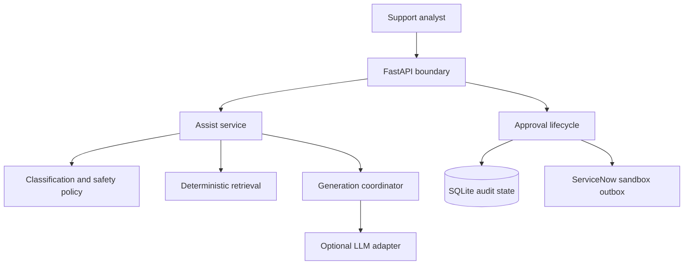
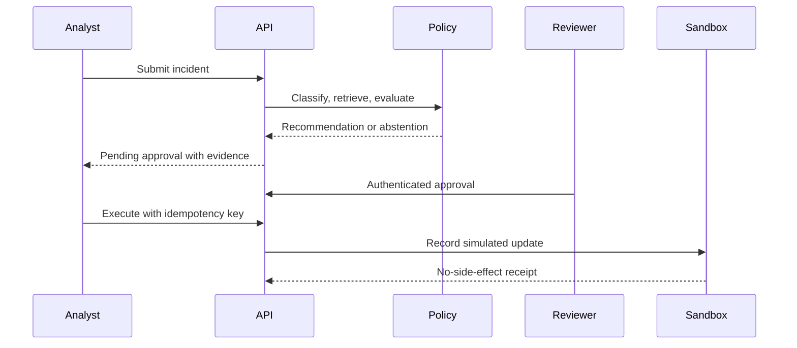

# Architecture

The agent is decision support, not autonomous remediation. Infrastructure adapters point inward
through domain ports, while policy and lifecycle rules remain independent of FastAPI, SQLite,
ServiceNow-compatible payloads, and optional model providers.

## Trust boundaries

1. Incident and knowledge text are untrusted data, including when passed to a model provider.
2. Generated JSON must satisfy schema, citation, grounding, and unsafe-instruction guardrails.
3. High-risk incidents never use primary LLM generation.
4. Recommendations cannot execute before an authenticated human approval.
5. Execution is idempotent and writes only to the durable local sandbox outbox.
6. The ServiceNow-compatible contract makes no external network call.

## Runtime flow

SQLite is appropriate for this single-node portfolio PoC. Multi-instance deployment requires a
transactional shared database, centralized metrics, managed secrets, and platform-level controls.
